# Defending Against the Training–Inference Numeric Mismatch in RL (Especially Linear Attention) — and Whether It Helps Async RL

*Yichuan Wang in collaboration with the TorchTitan team · August 2026*

## The result, up front

**Qwen3.5-9B-Base** trained on
[DAPO-Math-17k](https://huggingface.co/datasets/BytedTsinghua-SIA/DAPO-Math-17k),
async RL at `offpolicy = 12` (rollouts can be up to 12 steps stale; §4.1 unpacks
this). Three setups, same data, same recipe. **BI** in the legends is short for
**batch invariance**, the property we spend section 3 building, and the shorthand we
use for the rest of the post:

<div class="fig-row" style="display: flex; gap: 1rem; align-items: flex-start;" markdown="1">

<div style="flex: 1 1 0; min-width: 0;" markdown="1">


*Train/inference logprob gap (lower is better).*

</div>

<div style="flex: 1 1 0; min-width: 0;" markdown="1">

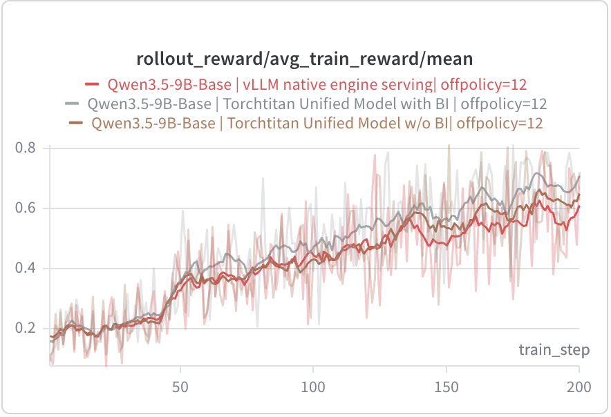

*Training reward (higher is better).*

</div>

</div>

Three lines in both plots:

- **red**: vLLM native engine serving (the standard two-engine setup);
- **brown**: TorchTitan **unified model**: trainer and generator share one model
  definition, but with stock kernels;
- **grey**: the same unified model, **plus batch-invariant kernels** (BI).

The ordering is the same on both sides: grey has the **lowest** logprob gap and the
**highest** reward. **In this configuration**, closing the numerical mismatch does
show a reward gain. Whether it holds up across other off-policy windows and other
workloads, and what it costs, is the rest of the post, and the answer is not a clean
yes.

The single most telling point is at **step 0**, where the grey curve's
`bit_wise/logprob_diff/abs_mean` is **exactly 0**. At step 0 nothing is stale yet, so
this is the clean measurement: with BI kernels, our system has **no train/inference
mismatch at all**: bitwise parity between trainer and generator. Every nonzero value
after that is *off-policy staleness*, not precision noise. That separation is the
whole point: once the infra term is provably zero, whatever gap remains is genuinely
algorithmic, and you can reason about it.

The rest of the post is how we got there, and what it does (and does not) buy you.

---

## 1. Intro

Reinforcement learning on LLMs runs on **two different engines**. Training happens
in one stack (Megatron, TorchTitan, or PyTorch FSDP); rollout generation in another
(SGLang, vLLM). They are tuned for opposite goals (the trainer for throughput, the
generator for latency), so under the hood they run **different kernels**: different
matmul tilings, attention implementations, and reduction orders.

That is fine until you recall what RL asks of them. The generator samples a token
and reports its log-prob `μ`; the trainer later recomputes the log-prob `π` of that
*same* token under (nominally) the same weights. Different kernels, plus
non-associative floating-point ([Thinking Machines, *Defeating Nondeterminism in
LLM Inference*](https://thinkingmachines.ai/blog/defeating-nondeterminism-in-llm-inference/)),
mean **the same token comes back with a different logprob from each engine.** That
gap is pure infrastructure (no policy actually changed), yet it leaks into the RL
signal as **numerical noise**. This is the **train/inference mismatch**: an infra
artifact masquerading as an algorithmic one. So when an RL run misbehaves, *"is this just infra precision?"* is
a suspect you can never quite rule out. The goal we want is simple to state:
**infra-level numerical error should not leak into the algorithm.**

And by 2026, across the open-source landscape, it is only getting harder, for two
reasons.

1. **Architectures keep getting fancier, and holding the mismatch at zero gets
   harder with them.** The frontier open-source models no longer ship plain
   quadratic attention: linear attention in the latest Qwen and Kimi,
   sliding-window attention in Inkling, sparse attention in DeepSeek. Take linear
   attention as the example: instead of keeping an explicit KV cache, it
   compresses the entire context into a fixed-size **recurrent state**. It is
   genuinely unclear whether squeezing global information into so small a state
   makes the numerics *more* sensitive, and as far as we know, **no open-source
   stack has hit train/inference KL = 0 for linear attention** yet.
2. **Async RL is going mainstream.** To overlap the trainer and the generator,
   async RL lets the generator run several steps behind the live policy, so `μ` is
   a genuinely *older* policy than `π`, and the ratio `exp(π − μ)` is *supposed* to
   be ≠ 1 (that's what the clipped surrogate is for). But the popular open-source
   loops (slime, open-instruct) compute that ratio from raw `μ` and `π` directly,
   which **conflates two very different mismatches**: the *algorithmic* one from
   staleness (which the surrogate is designed to absorb) and the *numerical* one
   from precision (which it is not). When something breaks, you cannot tell whether
   the culprit is async or infra.

The folk wisdom here is that driving the train/inference KL to zero should make
async RL more stable: clean out the numerical mismatch, and the off-policy window
can be pushed wider. It is a plausible story, but there is **little open evidence
for it either way**.

**Before we dive in: TorchTitan and TorchTitan RL.** Everything below is built on
[TorchTitan](https://github.com/pytorch/torchtitan), PyTorch's own training framework.
It is torch-native, deliberately clean and small enough to read end to end (which
also makes it unusually friendly to coding agents), and it supports the parallelisms a
serious pretraining stack needs: **FSDP, TP, CP, and EP**.

**TorchTitan RL** is a feature the TorchTitan team brought up this year: an RL stack
built on that trainer, with **async RL**, **hackability**, and the one that carries
this post: **one unified model definition shared by the trainer and the generator**
(§3.1 is where you will see why that is worth having). The bet behind it is simple:
TorchTitan has done well as a pretraining framework, so an RL platform that *owns its
own trainer*, rather than gluing two independent stacks together, is worth building.

So we wrote this post. You will see:

1. a quick recap of the key notions (**determinism**, **batch invariance**, and
   **trainer/generator bitwise parity**): what the train/inference mismatch really
   is, and what the open-source stack already handles (which ops have
   batch-invariant kernels);
2. how we push it further, closing the mismatch at the **RL-engine level** (one
   model definition for both sides) and then at the **operator level** (linear
   attention, etc., where **batch invariance** is what we need), driving the numerical
   difference between trainer and generator to zero;
3. what happens when *zero mismatch* meets **async RL**, across three regimes:
   **long math reasoning**, **multi-turn single-agent** (search agent), and
   **multi-turn complex-agent** training (terminal agent): does bit-exact parity
   actually let us push the async off-policy window wider?;
4. the bottom line, whether closing this mismatch is actually worth it: the costs,
   and the benefits.

---

## 2. Background: determinism, batch invariance, and bitwise parity

Three notions we lean on throughout the post:

- **Determinism**: the same input batch produces the same result run-to-run. Rerun
  the identical forward on the identical batch, get identical bits.
- **Batch invariance**: a *single sample* produces the same result regardless of
  which other samples share its batch. This is strictly stronger than determinism: a
  kernel can be perfectly deterministic (stable for a fixed batch) yet still
  batch-*variant*: its output for one row shifts the moment the batch's shape or
  composition changes.
- **Trainer/generator bitwise parity**. The end-to-end goal: the trainer's
  recomputed logprob `π` equals the generator's rollout logprob `μ` bit for bit.
  This is what "**train/inference zero logp difference**" means in practice.

The culprit underneath all of this is floating-point non-associativity:

```
(a + b) + c  ≠  a + (b + c)
```

Every kernel that sums something has to pick an order to fold the partials together,
and a high-performance kernel picks that order *per shape*, to maximize occupancy on
the tensor it happens to be handed. So the reduction order is a property of the
shape, not of the math: change the batch, and the summation order changes with it.
Same math, different low bits. That is what breaks `π = μ`.

Batch invariance, then, comes down to one thing: **a reduction somewhere is happening
along the batch-size axis.** (The full kernel-level derivation is in the TML blog;
we only recap enough to build on it.)

So the recipe for parity falls out: make every op **batch-invariant** (a fixed
reduction order, independent of the batch), run both engines **deterministically**,
and the two logprob streams collapse onto each other: zero mismatch.

### What the open-source stack already covers

The first people to attack batch invariance and determinism in the open were
Thinking Machines, in the blog above plus its
[`batch_invariant_ops`](https://github.com/thinking-machines-lab/batch_invariant_ops)
repo. That repo gives batch-invariant kernels for **three ops**: RMSNorm, GEMM, and
attention:

| Op | Why it is batch-variant by default | Fix |
|---|---|---|
| **RMSNorm** (`mean.dim`) | with few rows, the kernel splits the reduction across the batch axis to fill the GPU | don't reduce along the batch-size axis |
| **GEMM** (`mm` / `addmm`) | tile size and split-K are picked per shape | each output element uses the same reduction partition and reduction order, independent of the batch size or of the other rows present in the GEMM |
| **attention** | flash-decoding splits the KV dimension, and the split count depends on `max_k`, i.e. on the batch | set `num_splits = 1`, which disables split-KV and so fixes the reduction order. Leaving splits on is not just a reduction-order problem: at inference the attention mask has to be handled in step with the reduction chunk size, and that chunk count is itself a function of the batch |

There is also work on the *cross-GPU* version of the problem: [Zhang et
al.](https://arxiv.org/abs/2511.17826) use tree-based TP (one unified hierarchical
binary reduction tree within and across GPUs) to get no train/inference mismatch
even when the trainer runs FSDP at `TP = 1` and the generator runs multi-GPU TP. It
works, but it greatly sacrifices speed.

Worth noting: **DP at inference time, and DP/FSDP at training time, cause no extra
mismatch**, because neither reduces along the batch-size axis.

That is where the open-source coverage stops. It is enough for the architecture of
2023, and it is exactly the set of ops the newest models are moving *away* from. How
to handle newer architectures, **MoE** and **linear attention**, is unclear.

---

## 3. How we close the mismatch: one model definition, then batch-invariant kernels

We answer this at two levels at once: the **RL-engine level** and the **operator
level**.

### 3.1 RL-engine level: one model definition for both sides

As we said at the top, the training engine and the serving engine are developed
independently, so the two sides carry **two different model definitions**. That is
not just a code-duplication annoyance; it is a numerical one. Some op inside a layer
runs in fp32 on the training side and not on the serving side, and nobody notices
until the logprobs disagree. Then somebody has to go fix it by hand: see, for
example, [miles #975](https://github.com/radixark/miles/pull/975), which keeps
Qwen3.5's `A_log` in fp32 all the way through Megatron's bf16 wrapping so that
Megatron and SGLang agree again. Multiply that by every op in the model and you get
the real cost: **a lot of human effort spent aligning Megatron's and SGLang's
precision**, op by op, forever.

vLLM's [bitwise-consistent training and inference](https://vllm.ai/blog/2025-11-10-bitwise-consistent-train-inference)
post attacks this by **patching the same kernels into both engines**: they import
vLLM's forward ops into the trainer (writing backward passes for them, since
inference kernels carry no gradients) and audit every kernel invocation in the
forward pass. It gets to bitwise parity, but the patching has to be done on both
sides, and, as they note themselves, there are still two copies of the model code,
which is "fragile for long-term maintenance."

Our approach gets this for free from **TorchTitan's unified model abstraction**:
both frameworks enjoy the *same* model definition, the TorchTitan model. The
serving side keeps only vLLM's **KV-cache management** (paged attention, prefix
caching), but every per-layer op it runs is the trainer's op. So a forward pass is a
forward pass: trainer and generator execute the same code, at the same precision,
and the whole alignment problem above simply does not arise.

### 3.2 Operator level: linear attention

<div class="fig-float" style="float: right; width: 42%; margin: 0.2rem 0 1rem 1.6rem;" markdown="1">

![Dataflow of Qwen3.5 batch-invariant mode. Left, TRAINER: training tokens go through a RECURRENT forward to activations/logits and the loss; the backward pass uses the CHUNKED kernel to produce gradients. Right, INFERENCE/GENERATOR: prompt tokens go through a RECURRENT prefill into the recurrent state, and RECURRENT decode reads and updates that state to emit the next token. Dashed arrows link the trainer's recurrent forward to both the generator's prefill and decode, marking the ops that are bitwise identical across the two engines.](../asset/ti-mismatch-qwen35-bi-dataflow.png)

*The recurrent kernel (green) is shared by the trainer's forward, the generator's
prefill, and the generator's decode. Those are the three places that must agree.
The chunked kernel (orange) survives only in the backward pass, where batch
invariance does not matter.*

</div>

TML gives us GEMM, attention, and RMSNorm, and for an older model like Qwen3 that is
enough. For the new ones (Qwen3.5, Kimi 3) it is not: we additionally
have to handle **linear attention**, plus its **state cache management** and its
**prefix caching**.

**Background.** For GDN (Gated DeltaNet), most open-source implementations (e.g.
[FLA](https://github.com/fla-org/flash-linear-attention)) use a
[**chunked**](https://github.com/fla-org/flash-linear-attention/blob/main/fla/ops/gated_delta_rule/chunk.py)
kernel for training and prefill, and a
[**recurrent**](https://github.com/fla-org/flash-linear-attention/blob/main/fla/ops/gated_delta_rule/fused_recurrent.py)
kernel only for decode. The chunked
kernel slices the sequence into fixed-size chunks, computes each chunk in matrix
form, and carries the state across chunk boundaries; the recurrent kernel walks the
sequence token by token. The two compute the same function in a *different order*,
so they do not agree bit for bit. Note what this means: the gap here is not a
mistuned kernel, it is **two different algorithms** on the two sides of the RL loop.

**Solution.** Continue using the vLLM SSM state, but switch **both prefill and
decode to the recurrent kernel**. For training, use the **recurrent kernel for the
forward pass and the chunked kernel for the backward pass**. Only the forward
computation needs to be batch-invariant.

And that is it. The change is smaller than the problem sounds. We **reuse vLLM's
linear-cache management as is**: its `mamba_ssm_cache` and conv state, and its state
snapshotting under `--mamba-cache-mode align`, which means **prefix caching keeps
working** rather than having to be rebuilt around our kernels. We also **never touch
the inside of the FLA kernels**, because the recurrent kernel is *intrinsically*
batch-invariant: it reads only that sequence's own state and walks that sequence's
tokens in a fixed order. There are no reductions or atomics across sequences, so
there is no batch axis left to reduce along.

Going all-recurrent on the forward is the sensible direction for the trade, rather
than a free one: in a normal RL step the trainer is not the bottleneck, generation is,
so the trainer is the right side to spend on. What it actually costs in trainer
throughput we measure in §4.2 (Finding 3).

The rest is the easy part: **`num_splits = 1` on the attention path, and patch in Thinking
Machines' batch-invariant GEMM.**

<div style="clear: both;"></div>

---

## 4. Results: async RL without the train/inference mismatch — performance or illusion?

### 4.1 A recap of async RL

Sync RL puts a barrier between generation and training, and it costs twice: each
side **idles while the other works**, and the generator's step time is set by its
*slowest* sequence, so **long-tail requests bottleneck the whole batch**. Async RL
drops the barrier: the two overlap, and a straggler just lands in a later batch.

The price is that the weights that produced a rollout are no longer the weights being
updated. That lag is the **off-policy window** (`offpolicy = 12` above means a rollout
can be up to 12 steps stale), and it is corrected with the **importance sampling
ratio**. For a token sampled under the generator's old policy `μ` and re-evaluated
under the trainer's current policy `π`:

```
r = π(a|s) / μ(a|s) = exp(π_logprob − μ_logprob)
```

**How we manage the KV cache across a weight swap.** One design decision shapes every
experiment below, so it is worth stating before the results: **`μ` for a single
rollout need not come from a single weight version.** A sequence that is still
decoding when a weight update lands straddles two policies. AReaL's answer is to drop
the KV cache at the pause and recompute it after the swap; ours is to **keep the cache
and simply continue decoding with the new weights**.

Neither choice is more faithful than the other, and it is worth being precise about
why. Recompute means each token's `μ` belongs to a genuine historical weight version.
Keeping the cache means the policy that actually did the sampling is a **hybrid** that
exists in no single weight version at all. Both are equally honest accounts of
something slightly awkward. What keeping the cache buys is practical: **importance
sampling still works out of the box**, and **system efficiency is much higher**,
because nothing has to be re-prefilled.

Every run in §4.2 uses this policy. We did not run the recompute variant, so we cannot
say for certain whether it would change the conclusions below.


*Sequences that straddle a weight swap (outlined) carry tokens from two versions. We
keep the KV cache across the pause (no recompute), so each token's `μ` belongs to
the weights that generated it.*

`r` keeps the gradient approximately unbiased under the policy actually being
updated, and PPO/GRPO's clipped surrogate bounds how far it may drift. Under async RL
`r ≠ 1` by design.

The catch: **we want `r` to be about weight versions and nothing else**. But `μ`
comes from the generator and `π` from the trainer, so in a stock stack `exp(π − μ)`
is staleness *plus* numerical mismatch. Zero the mismatch and the ratio becomes a
clean statement about how stale the sample is.

Hence the hypothesis everyone holds and nobody has tested: a mismatch-free engine
should **tolerate a wider off-policy window**, or **train more stably at the same
one**. Does it?

### 4.2 Evaluation and analysis: async RL with zero train/inference mismatch

We evaluate on three workloads, picked to span the two axes an RL system actually
feels: how many turns, and how long each generation is:

| Workload | Shape | Data |
|---|---|---|
| **MATH** (§4.2.1) | single-turn, long generation | DAPO-Math-17k |
| **Search-R1** (§4.2.2) | multi-turn, short generation | Wikipedia search, exact-match reward |
| **TMax terminal agent** (§4.2.3) | multi-turn, long generation | `allenai/tmax-15k-open-instruct`, sandboxed |

For each we run with and without BI and report the effect on **training reward** and
on **efficiency**; on MATH we also sweep the **off-policy window**.

#### 4.2.1 MATH: single-turn, long generation

Qwen3.5-9B-Base trained on DAPO-Math-17k, 40 GPUs, trainer and generators fully
disaggregated, and `TP = 1` on both sides, so none of the mismatch below comes from
cross-GPU reduction order. DP and FSDP do not reduce along the batch axis, which
leaves only the kernels to blame.

<details markdown="1">
<summary>Full setup</summary>

| | |
|---|---|
| **Trainer** | 8-way FSDP, `TP = 1`, no PP/CP; FullAC |
| **Generators** | 4 × vLLM replicas, `DP = 8`, `TP = 1`; prefix caching on |
| **Batch** | 8 prompts × 16 rollouts = 128 sequences/step; 8K response cap in a 10K packed context |
| **Optimizer** | AdamW, constant lr 1e-6; DAPO loss, clip `(0.2, 0.28)` |
| **Precision** | FP32 master weights + BF16 forward + FP32 reduction; FP32 LM head and FP32 GDN state cache |
| **Sampling** | temperature 1.0, top-p 1.0 |
| **Eval** | AIME2025, 30 samples, every 10 steps; 200 train steps |

</details>

**Case study at `offpolicy = 12`: three levels of alignment.** Start with one window
and three runs that differ only in how hard they try to make the two engines agree:

| Run | Model definition | Kernels |
|---|---|---|
| **vLLM native** (red) | vLLM's own implementation, trainer weights loaded into it | whatever vLLM ships |
| **Titan unified, w/o BI** (brown) | one shared definition (§3.1) | stock: split-K attention on, chunked forward, stock GEMM |
| **Titan unified, w/ BI** (grey) | one shared definition | aligned (§3.2): split-K off, batch-invariant GEMM, recurrent forward on both sides |

The first is what most stacks do: take the trainer's weights and load them into
vLLM's model. The *weights* match, but op for op it is a **different
implementation**, so precision differs all over. The second fixes that (trainer and
generator run one model definition) but leaves the **kernels unaligned**: attention
still splits K, the GEMMs are stock, and the trainer's chunked forward is not the
generator's recurrent one. The third aligns those too.

<div class="fig-row" style="display: flex; gap: 0.8rem; align-items: flex-start;" markdown="1">

<div style="flex: 1 1 0; min-width: 0;" markdown="1">

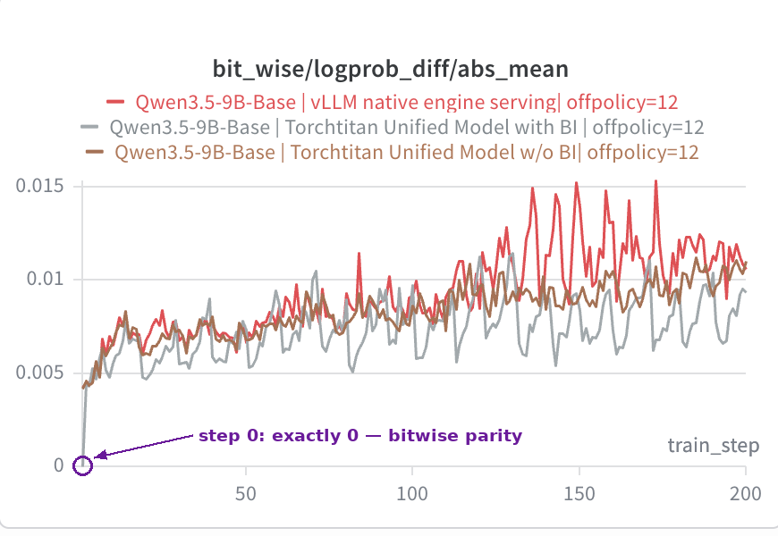

*logprob gap (lower is better)*

</div>

<div style="flex: 1 1 0; min-width: 0;" markdown="1">


*train reward (higher is better)*

</div>

<div style="flex: 1 1 0; min-width: 0;" markdown="1">

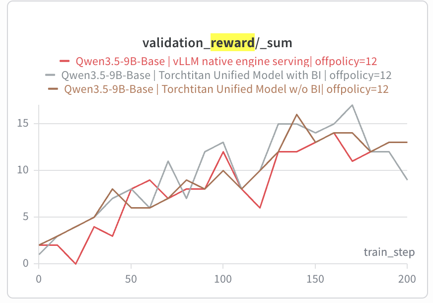

*validation reward, AIME2025 (higher is better)*

</div>

</div>

The three runs form a ladder of strictness, and the metrics respect it. On the
logprob gap the order is clean: red above brown above grey, with grey at **exactly
0 at step 0** (circled): no mismatch before staleness enters. Train reward follows
the same order in reverse: grey finishes highest, brown just under, red last.
Validation reward is noisier, as validation always is, but grey reaches the highest
peak (~17 at step 170) and spends most of the run at or above the others.

So **the stricter the alignment, the better every metric looks**, at this window.
The obvious next question is whether that survives when the window moves, so we swept
it: `offpolicy = 4`, `12`, `32`, now with just the two unified runs, with and without
BI.

**Finding 1. BI holds the logprob gap down at every off-policy window, and keeps it
from exploding at large ones.**

<div class="fig-row" style="display: flex; gap: 0.8rem; align-items: flex-start;" markdown="1">

<div style="flex: 1 1 0; min-width: 0;" markdown="1">

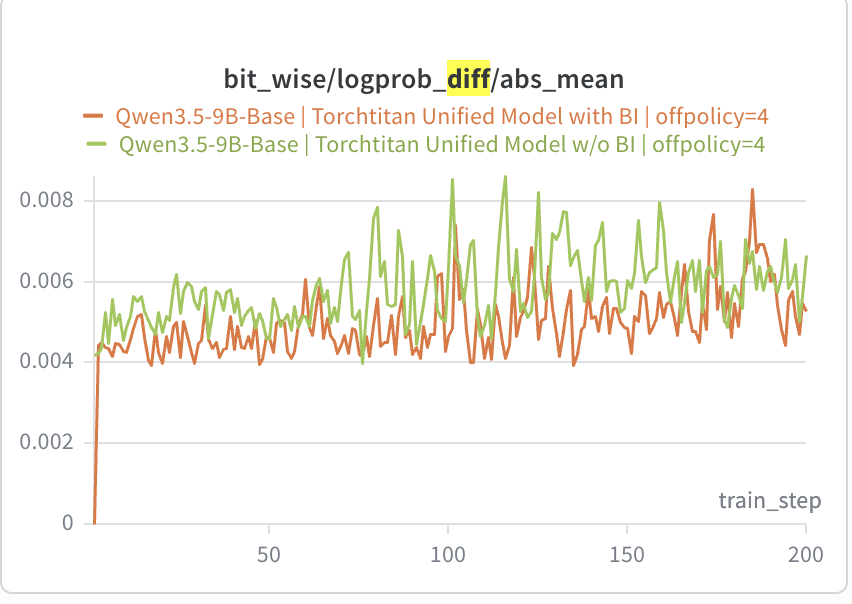

*`offpolicy = 4`*

</div>

<div style="flex: 1 1 0; min-width: 0;" markdown="1">

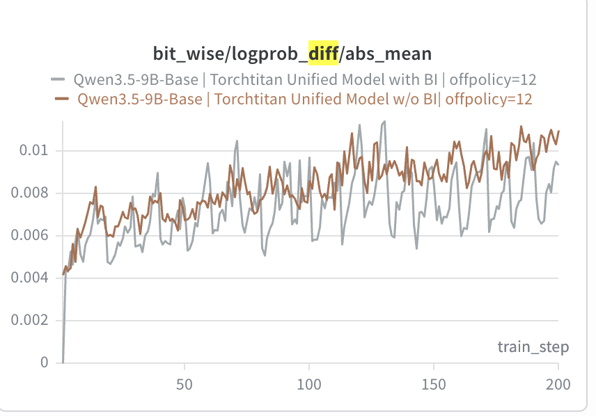

*`offpolicy = 12`*

</div>

<div style="flex: 1 1 0; min-width: 0;" markdown="1">

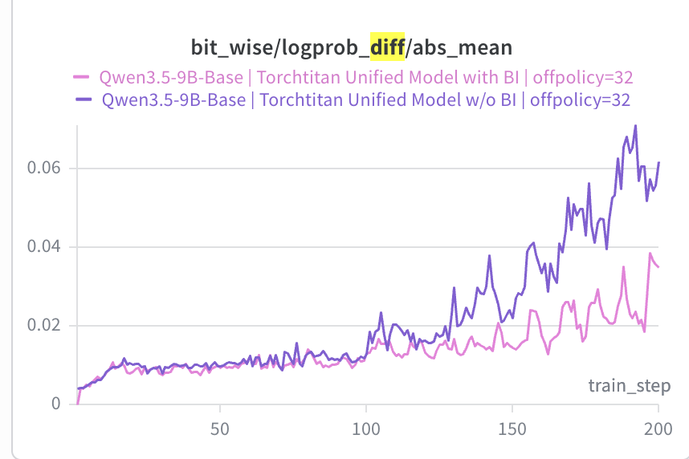

*`offpolicy = 32`*

</div>

</div>

*`bit_wise/logprob_diff/abs_mean` under three off-policy windows. Note the y-axis
changes: 0.008 on the left, 0.012 in the middle, 0.07 on the right.*

At `offpolicy = 4` the separation is real but modest: the run without BI rides
slightly above BI the whole way and spikes higher, but both stay in the same band. At
`12` the gap is steadier, with BI holding ~0.009 against ~0.011. At `32` the run
without BI **runs away**: it leaves the shared trajectory around step 100 and
reaches ~0.065 by step 200, while BI tops out near ~0.035, roughly half.

So the benefit is not uniform. BI lowers the gap everywhere, but what it really buys
is **protection against the blow-up**, and the wider you push the off-policy window,
the more there is to protect.

**Finding 2. That cleaner signal does not turn into validation accuracy.**

<div class="fig-row" style="display: flex; gap: 0.8rem; align-items: flex-start;" markdown="1">

<div style="flex: 1 1 0; min-width: 0;" markdown="1">

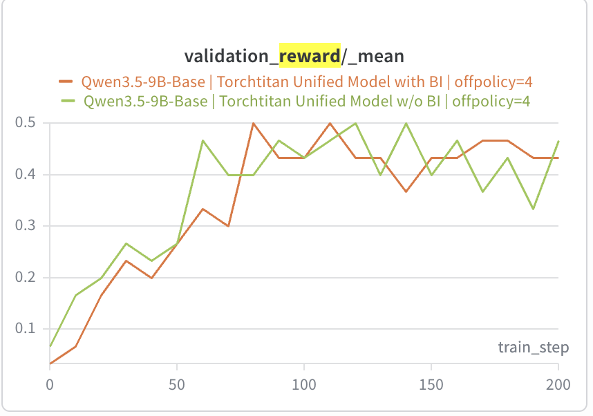

*`offpolicy = 4`*

</div>

<div style="flex: 1 1 0; min-width: 0;" markdown="1">

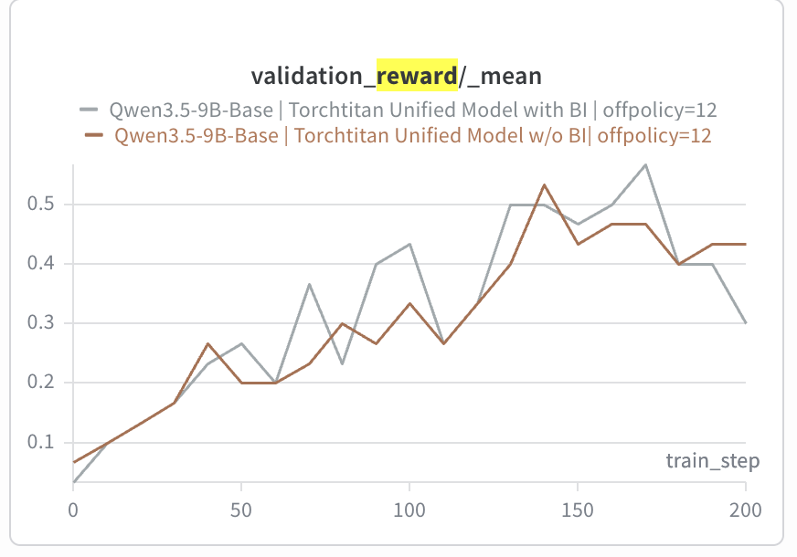

*`offpolicy = 12`*

</div>

<div style="flex: 1 1 0; min-width: 0;" markdown="1">

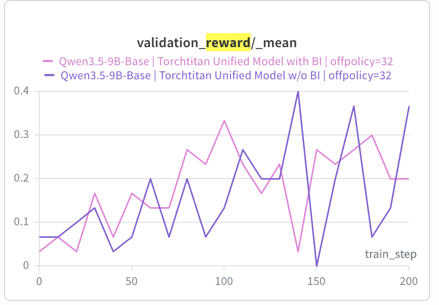

*`offpolicy = 32`*

</div>

</div>

*`validation_reward_mean` on AIME2025 (30 samples, every 10 steps). Both runs are the
same recipe, differing only in BI. Note the y-axis: 0.5 on the left two, 0.4 on the
right.*

At `offpolicy = 4` the two curves are interleaved for the entire run; you could swap
the labels and not notice. At `offpolicy = 12` BI does look better for a stretch: it
sits above from roughly step 70 to 170 and peaks higher (~0.57 vs ~0.53). But the
curves cross repeatedly, and no-BI ends the run on top. At `offpolicy = 32` both runs
degenerate into noise, swinging between 0 and 0.4 with no separation and a ceiling
well below the narrower windows. The window itself has become the problem, and BI
does nothing about it.

That is the honest read: **zero train/inference mismatch does not buy a clear
accuracy gain under async RL.** It reliably cleans up `logprob_diff` (Finding 1 is
unambiguous), but the metric that matters moves within noise. Whatever the surrogate
was struggling with at these off-policy windows, it apparently was not the numerical
term.

**Finding 3. BI costs 2–3× trainer throughput. The unified model costs nothing.**

<div class="fig-row" style="display: flex; gap: 0.8rem; align-items: flex-start;" markdown="1">

<div style="flex: 1 1 0; min-width: 0;" markdown="1">


*`offpolicy = 4`*

</div>

<div style="flex: 1 1 0; min-width: 0;" markdown="1">

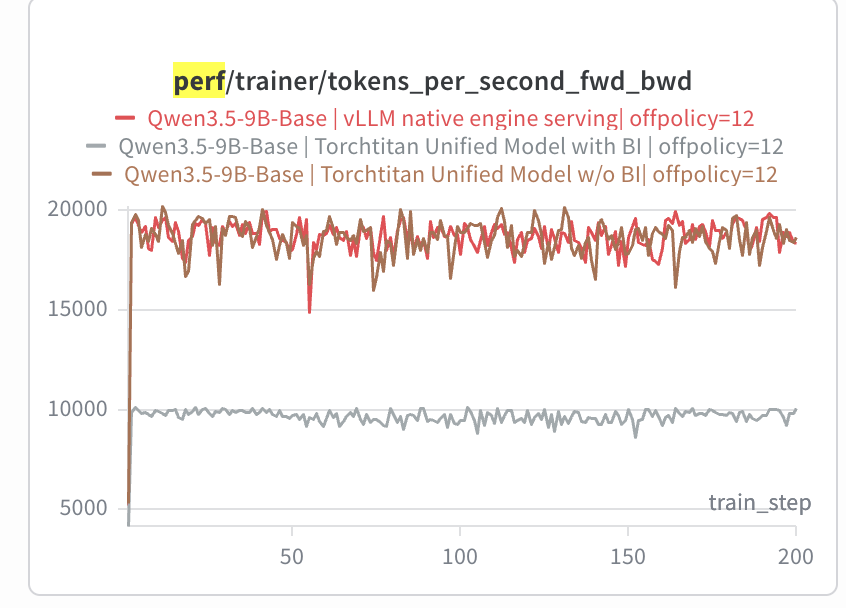

*`offpolicy = 12`*

</div>

</div>

*`perf/trainer/tokens_per_second_full_step`, the same metric we report for the other
two workloads below, so the numbers are comparable across all three.*

Three things fall out.

**BI costs 2–3×.** At `offpolicy = 12` the BI run holds ~8.4k tokens/s against ~14.5k
without. At `offpolicy = 4` it is worse and much spikier, averaging roughly ~4k against
~12k. That is the recurrent forward, split-K disabled, and the batch-invariant GEMM,
all of which trade occupancy for a fixed reduction order. Note that the penalty is not
a constant: it depends on how much work is in flight to hide the slower kernels
behind.

**The unified model is free.** vLLM native and the unified model without BI sit in the
same band (~12.2k against ~14.5k at `offpolicy = 12`). Sharing one model definition
between trainer and generator, the §3.1 half of the story, carries no throughput
penalty. **The entire bill is the aligned *kernels*.**

**A wider window raises throughput, and BI needs it most.** Every curve is higher and
flatter at `12` than at `4`. BI gains the most from the wider window (~4k → ~8.4k):
being slower per step, it has more latency to hide, and a wider window is what gives
it enough in-flight rollouts to hide it behind.

**So, can we push the off-policy window wider?** That was the question at the end of
§4.1, and `offpolicy = 32` is where to look for the answer. On the numerical axis, yes:
without BI the logprob gap runs away past 0.06, while BI holds it near half that. In
that narrow sense a mismatch-free engine *does* tolerate more staleness: it stays in
a regime the stock stack has already left. But the accuracy plots at `32` are noise for
both arms, so the wider window is not usable either way. **BI removes the numerical
obstacle to a wider window; it does not remove whatever else is in the way.**

Put the three findings together and the trade is explicit: **BI buys a provably zero
mismatch and a logprob gap that will not explode, at 2–3× the trainer throughput and
no clear accuracy gain.** We are not going to tell you which side of that to pick. The
numbers are on the table.

**Curious about MoE?** We ran the same three-arm comparison on **Qwen3.5-35B-A3B**.

<details markdown="1">
<summary>MoE: Qwen3.5-35B-A3B on the same MATH recipe</summary>

Same DAPO-Math data, same `offpolicy = 12`, same three arms: vLLM native, the unified
model without BI, and the unified model with BI. Two things to report, and they point
in different directions.

<div class="fig-row" style="display: flex; gap: 0.8rem; align-items: flex-start;" markdown="1">

<div style="flex: 1 1 0; min-width: 0;" markdown="1">

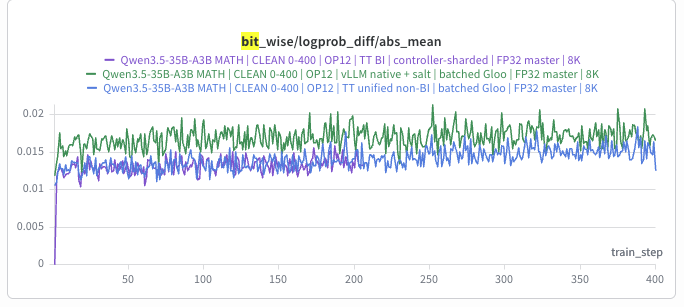

*logprob gap*

</div>

<div style="flex: 1 1 0; min-width: 0;" markdown="1">

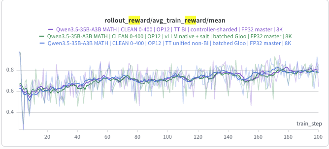

*train reward*

</div>

</div>

**The logprob gap does come down, but from the unified model, not from BI.** vLLM
native (green) sits clearly above the other two throughout. The unified model with BI
(purple) and without (blue) lie on top of each other over the range where both are
running. Note the BI arm is the shorter curve: it was around step 200 when these were
taken, against 400 for the two completed arms.

**And there is no reward gain.** All three arms are interleaved from the start,
climbing together from ~0.6 to ~0.8.

MoE needed one extra kernel that the dense model did not. The router's gate is a
matmul, and the same matmul ends up calling **different ops on the two sides** (`bmm`
in the generator, `mm` in the trainer) because the generator hands it a 3-D batch of
activations and the trainer a 2-D one. `bmm` is not in the batch-invariant set, so we
patch in a **batch-invariant `bmm`** too. It matters more
than the usual low-bit drift: if the gate scores disagree between the two sides, a
token can be routed to a **different expert** entirely.

| | |
|---|---|
| **Model** | Qwen3.5-35B-A3B-Base. 40 layers, 256 routed experts, top-8 + 1 shared, hybrid attention (10 full / 30 Gated DeltaNet) |
| **Trainer** | 16-way FSDP, `TP = 1`, **`EP = 1`**, FullAC; packed `seq_len` 10,240 |
| **Generators** | 4 × vLLM replicas, `DP = 8`, `TP = 1`, `EP = 1`; prefix caching with a per-group salt on weight sync |
| **Batch** | 8 prompts × 16 rollouts = 128 sequences/step; 8K response cap; 400 steps |
| **Optimizer** | AdamW, constant lr 1e-6; DAPO loss, clip `(0.2, 0.28)`; aux-loss-free load balancing with an FP32 expert bias |
| **Precision** | FP32 master weights + BF16 forward + FP32 reduction; FP32 LM head and FP32 GDN state cache |
| **Eval** | AIME2025, 30 samples, every 10 steps |
| **Hardware** | 48 GPUs doing model work (16 trainer + 4 × 8 generator), disaggregated |

`EP = 1` on both sides is deliberate: with expert parallelism off there is no MoE
all-to-all, so this comparison isolates the kernels from cross-GPU dispatch, the same
way `TP = 1` does for the dense runs.

</details>

#### 4.2.2 Search-R1: multi-turn, short generation

The workload is the opposite shape from MATH. The model answers a question by
**searching Wikipedia**: it issues a query, reads the retrieved passages, decides
whether it knows enough, and queries again. Several turns per episode, each
generation short (a query, or a final answer). So an episode is many small calls
rather than one long one, and the reward is exact match against the gold answer.

Qwen3.5-9B, `offpolicy window = 4`, 500 steps, two arms: the unified model with and
without BI.

<div class="fig-row" style="display: flex; gap: 0.8rem; align-items: flex-start;" markdown="1">

<div style="flex: 1 1 0; min-width: 0;" markdown="1">

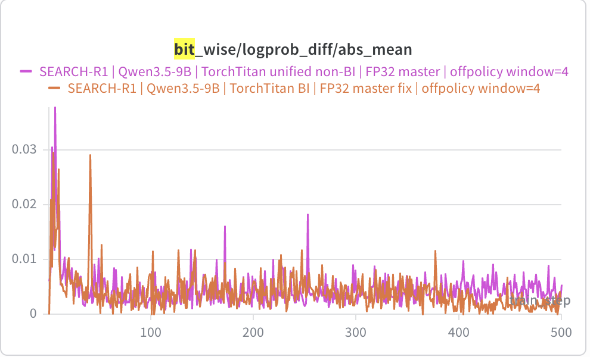

*logprob gap*

</div>

<div style="flex: 1 1 0; min-width: 0;" markdown="1">

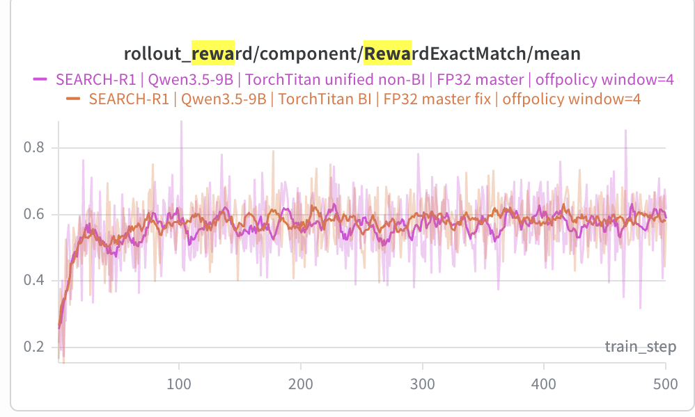

*train reward (exact match)*

</div>

<div style="flex: 1 1 0; min-width: 0;" markdown="1">

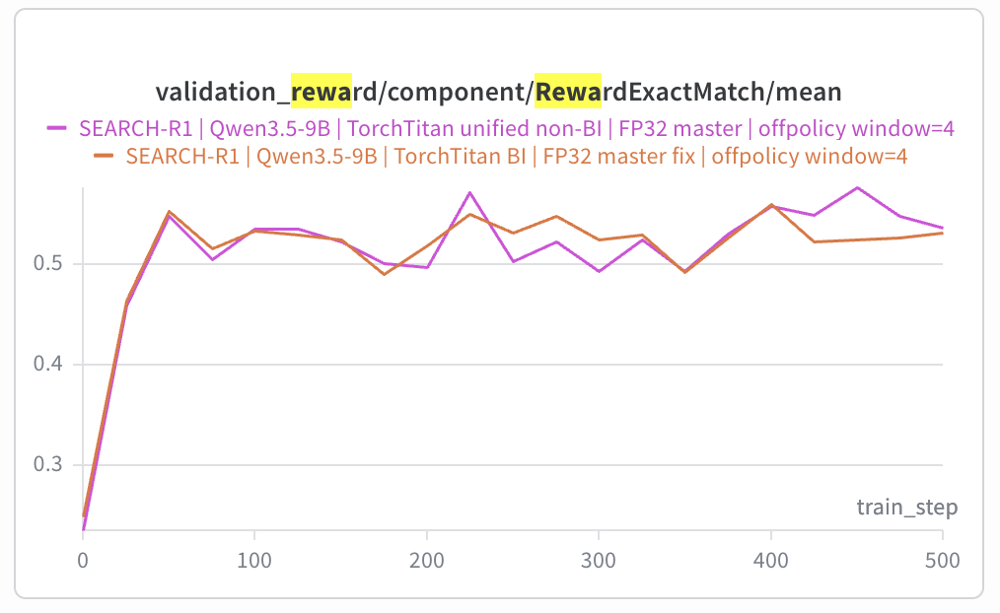

*validation reward (exact match)*

</div>

<div style="flex: 1 1 0; min-width: 0;" markdown="1">

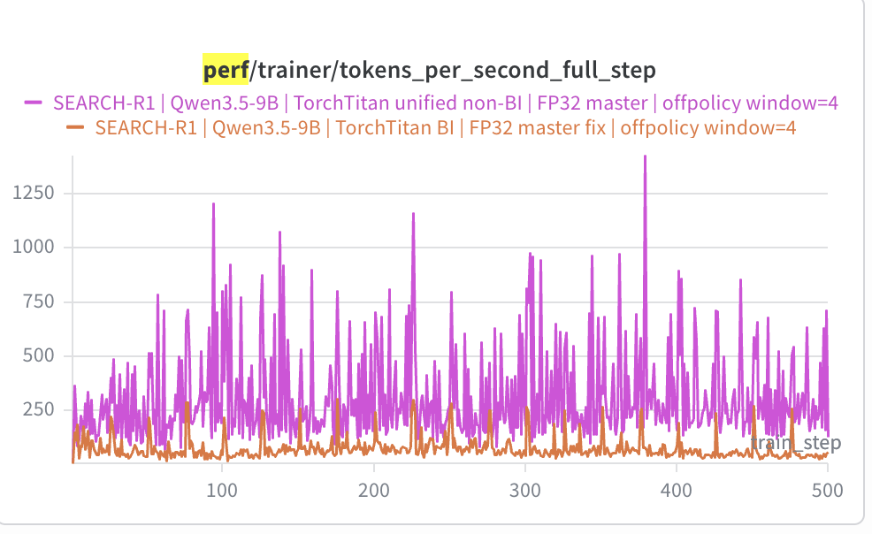

*throughput (full step)*

</div>

</div>

Same verdict, arrived at more cleanly. **Logprob gap:** BI starts at exactly 0 at step
0 here too, and over the last 100 steps it settles near ~0.002 against ~0.005 without,
so the mechanism is working. **Train reward:** both arms reach ~0.6 by step 100 and
stay interleaved for the next 400 steps. **Validation:** the two curves are
indistinguishable: genuinely on top of each other, not merely close. **Throughput:**
the BI arm runs below the non-BI arm for the entire run.

So flipping the workload shape (many short turns instead of one long generation)
does not change the answer. **No measurable accuracy gain, and you pay for it in
throughput.**

#### 4.2.3 TMax: multi-turn, long generation (terminal agent)

The hardest of the three, and the one closest to how agents are actually trained
today. Each episode is a real terminal session: the model is dropped into a fresh
[Daytona](https://www.daytona.io/) sandbox with a task description and a single `bash`
tool, and works the problem for up
to **64 turns** inside a **64K context**. There is no partial credit: at the end the
task's own test script runs and the reward is binary. Many turns *and* long
generations, both at once.

The data is [`allenai/tmax-15k-open-instruct`](https://huggingface.co/datasets/allenai/tmax-15k-open-instruct)
(~14.5K tasks after a 64-task holdout, each one a Docker image plus an instruction
and a verifier).

<details markdown="1">
<summary>Full setup</summary>

| | |
|---|---|
| **Model** | Qwen3.5-9B |
| **Episode** | ≤ 64 `bash` turns, 64K context, ≤ 16K tokens/turn; 120 s per command, 600 s verifier |
| **Sandbox** | fresh Daytona sandbox per rollout from the task's Docker image (2 vCPU / 4 GiB / 10 GiB); one `bash` tool, persistent shell; binary reward from `tests/test.sh` |
| **Trainer** | 8-way FSDP, `TP = 1`, FullAC; packed `seq_len` 65,536 |
| **Generators** | 6 × vLLM hosts at `DP = 8`, `TP = 1` → 48 engines; prefix cache salted per group on weight sync |
| **Batch** | 32 prompt groups × 8 rollouts = 256 rollouts/step; 100 steps |
| **Optimizer** | AdamW, constant lr 1e-6; DPPO loss with a TV trust region (threshold 0.1), 32 loss chunks |
| **Precision** | FP32 master weights + BF16 forward + FP32 reduction; FP32 LM head and FP32 GDN state cache |
| **Sampling** | temperature 1.0, top-p 1.0; `offpolicy window = 4` |
| **Hardware** | 56 GPUs (7 × 8), trainer and generators disaggregated |

</details>

<div class="fig-row" style="display: flex; gap: 0.8rem; align-items: flex-start;" markdown="1">

<div style="flex: 1 1 0; min-width: 0;" markdown="1">

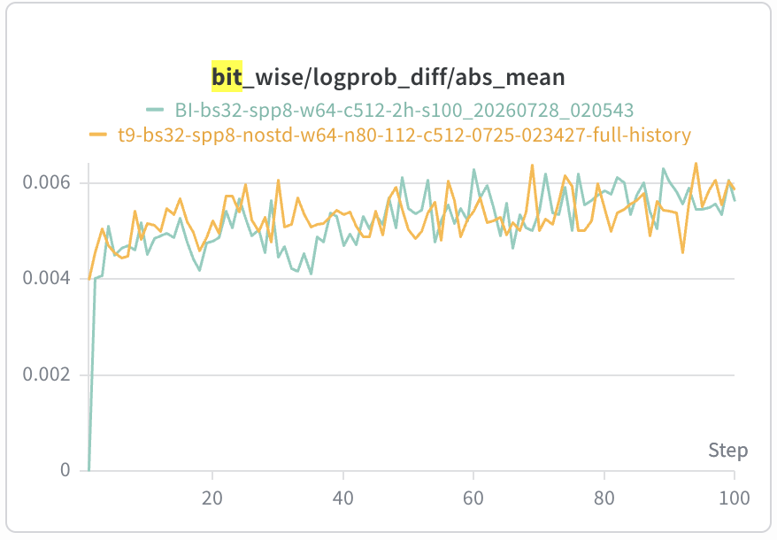

*logprob gap. Green is BI, yellow the unified model without it*

</div>

<div style="flex: 1 1 0; min-width: 0;" markdown="1">

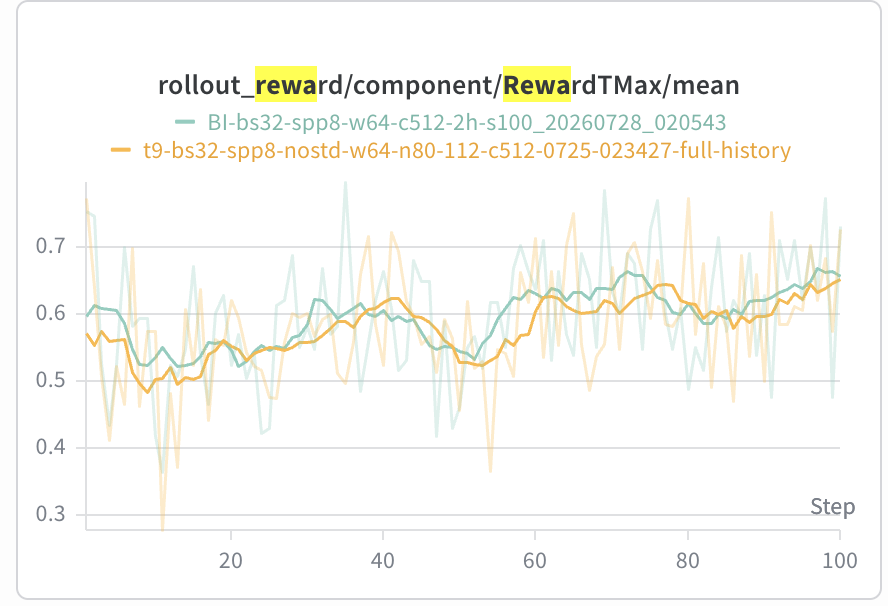

*task reward: BI slightly ahead*

</div>

<div style="flex: 1 1 0; min-width: 0;" markdown="1">

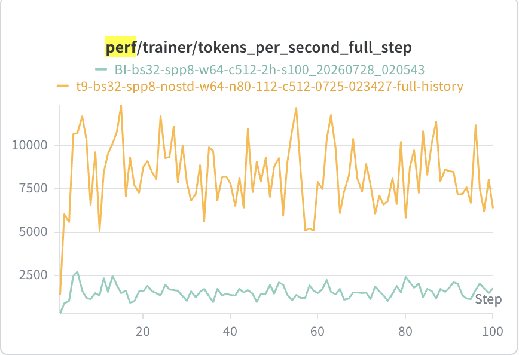

*throughput: BI several times slower*

</div>

</div>

**Logprob gap:** BI is exactly 0 at step 0, as everywhere else, but after that the
two arms are *indistinguishable*, both drifting between ~0.004 and ~0.006. This is the
one workload where BI does not visibly lower the running gap. With 64 turns of
sandboxed tool output in a 64K context, the staleness term dwarfs the numerical one.

**Reward:** and yet here BI is *slightly* ahead. The two arms are entangled for the
first 50 steps, then the BI curve sits a little above from ~55 to ~80, and both finish
around 0.65 (this is training reward; no held-out eval was run for this
configuration). It is the first workload where the alignment looks like it might be
buying something, and it is still small enough that one seed cannot settle it.

**Throughput:** and here is the bill. The BI arm runs at ~1.5–2k tokens/s against
~7.5–10k without, roughly 5× against the 2–3× on MATH, and measured in the same
metric. Long episodes are where the recurrent decode hurts most: a 64K context means
far more tokens walked one at a time.

Which is the trade in its sharpest form: the workload where bitwise parity finally
looks like it helps is also the one where it costs the most.

One thing we cannot explain, and would rather say so than leave you wondering: the
throughput curves swing a lot, and how much they swing differs between arms, here and
on the other two workloads. Part of it has to be queueing (a step that waits on
rollouts scores lower than one whose batch was ready), but we do not have a
measurement that pins it down.

**Stay tuned for more agentic training recipes, which we will release over the coming
month.**

---

## 5. Conclusion: a debugging tool, not a production default

After all that, here is where we land.

**Bitwise parity works, and it is worth less than we hoped.** On all three workloads
the logprob gap is exactly zero at step 0, which is the thing we set out to build. It
also stops the gap exploding at a wide off-policy window, though we only pushed the
window that far on math, and on the terminal agent BI does not visibly lower the
running gap at all. On reward and final accuracy
the payoff is real but small: a slight edge on the terminal agent, nothing separable
from noise on math or search. The best case for it is the async-tolerance argument:
with the numerical term gone, a wider off-policy window becomes safer to run. But
**that comes at 2–3× trainer throughput on math and search, and ~5× on the terminal
agent**, and at that price the cost/benefit does not close for a production run.

So we would put it somewhere else in the workflow: **as a debugging tool.** When a
post-training run misbehaves, turning BI on for 20 on-policy steps tells you something
you cannot otherwise learn: if the logprob gap is zero and the run is still broken,
the infra is exonerated and the problem is in your data or your algorithm. That is a
genuinely useful thing to be able to prove, and it costs 20 steps rather than a whole
run.

**Where this could change.** Three directions we think are worth pushing:

1. **More benchmarks.** Three workloads and mostly one seed each. The terminal-agent
   result is the one most likely to be real, and it is also the one we have the least
   of.
2. **Async-stable policy optimization.** Our conclusion is entangled with the
   optimizer. Methods built for staleness (IcePop and relatives) might interact with
   a zero-mismatch engine quite differently, since they are trying to solve the same
   problem from the algorithm side.
3. **Making BI cheap.** The 2–5× is not a law of nature; it is the cost of the
   specific kernels we wrote. If someone optimizes the recurrent forward and the
   batch-invariant GEMM hard enough, the trade changes on its own, and then the answer
   above flips.

    One concrete piece of that, for anyone who reads this far: **a faster
    batch-invariant attention.** We currently buy invariance with `num_splits = 1`,
    which is the bluntest possible instrument — it throws away split-KV parallelism
    entirely. And nobody has published a fast one: Thinking Machines' kernel buys
    attention invariance the same blunt way (§2), so as far as we know **a fast
    batch-invariant attention does not exist yet, from anyone.** The reason it is blunt
    rather than clever is that a split-KV kernel has
    to handle the attention mask *in step with* the reduction chunk size, and getting
    that pair right is fiddly. But a GEMM does not give up its tiling to be
    batch-invariant; it just fixes the reduction partition. Attention may well be the
    same: pick a **fixed** reduction chunk size, independent of `max_k`, and handle the
    mask against that fixed grid. If that is enough, most of the attention half of the
    2–5× goes away. We have not tried it.

This post covers a narrow slice of a large problem, and we would rather be corrected
than agreed with. If you have data that points the other way, or a workload where this
matters more than it did for us, email
**[yichuan_wang@berkeley.edu](mailto:yichuan_wang@berkeley.edu)**.

---

## Acknowledgements

This work was mainly done by Yichuan Wang, with the help of the [TorchTitan team](https://github.com/pytorch/torchtitan). Thanks also to [Charlie Ruan](https://www.charlieruan.com/), [Han Zhang](https://zhhhhahahaha.github.io/), [Yilong Zhao](https://ylzhao.me/), [Alexander Jiang](https://openreview.net/profile?id=~Alexander_Jiang1), [Shang Yang](https://hanlab.mit.edu/team/shang-yang), and [Zhichen Zeng](https://zhichenzzz.github.io/) for the helpful discussions.

Two open-source repos carry a lot of this work: [FLA](https://github.com/fla-org/flash-linear-attention),
whose Gated DeltaNet kernels we build on directly, and Thinking Machines'
[`batch_invariant_ops`](https://github.com/thinking-machines-lab/batch_invariant_ops),
which gave us both the batch-invariant GEMM and the framing for everything above.

The terminal-agent experiments run on [Daytona](https://www.daytona.io/) sandboxes, one
per rollout, and would not have been practical without them.

---

## Cite

```bibtex
@misc{wang2026traininginferencemismatch,
  title  = {Defending Against the Training–Inference Numeric Mismatch in RL (Especially Linear Attention) — and Whether It Helps Async RL},
  author = {Wang, Yichuan and the TorchTitan team},
  year   = {2026},
  month  = {August},
  url    = {https://yichuan-w.github.io/blog/GDN-train-inference-mismatch-asyncRL/}
}
```
