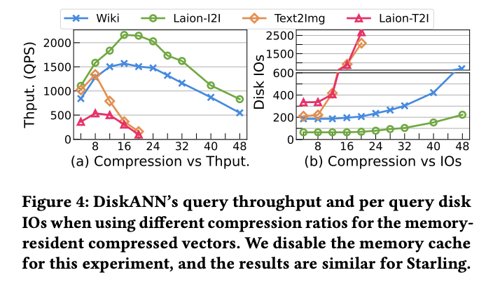

# Mastering DiskANN: Practical Lessons from Building Large-Scale Vector Search Systems

*By Yichuan Wang, Dec 11, 2025*

I've spent a lot of time working with [DiskANN](https://github.com/microsoft/DiskANN), utilizing it extensively in projects like [LEANN](https://github.com/yichuan-w/LEANN) and [DS-serve](https://github.com/Berkeley-Large-RAG/RAG-DS-Serve). It is a powerful system, but like any precision tool, getting the best performance requires some "craftsmanship." After nearly a year of tuning and experiments, here are some insights and recipes for configuring DiskANN perfectly.

## 1. The Hidden Trap: Distance Metrics Matter!

This bug haunted me for two weeks while developing DS-serve. Our initial QA performance was surprisingly poor (see figure below), and we couldn't figure out why.

Thanks to a hint from Rulin, [Jinjian](https://github.com/berkeleyljj) and I finally identified the culprit: **The Build Metric.**
We had assumed that L2, MIPS (Maximum Inner Product Search), and Cosine distance were interchangeable enough. **They are not.**

### The Root Cause: Training-Inference Mismatch
Many modern models (including Contriver) use **contrastive learning with MIPS**, not L2. If you build your index using L2 but your model was trained for MIPS, you create a fundamental mismatch. This is a common pitfall (I know many RL folks suffer from similar metric mismatches!).

**Recommendation:** For unnormalized embeddings, **always use MIPS**. We encountered this again when deploying LEANN—OpenAI embeddings required specific metric handling. You can see how we handled it in our [codebase](https://github.com/yichuan-w/LEANN/blob/3629ccf8f7dd7c765441e599d44f67eeab24cb27/packages/leann-core/src/leann/embedding_compute.py#L699).

*Correcting the metric instantly fixed the performance gap.*

(Sorry Matei for giving you this example twice haha!)

*   **Pro Tip:** For further reading, a recent [VLDB '24 paper](https://www.vldb.org/pvldb/vol18/p1770-ke.pdf) explores similar phenomena but offers a different perspective—definitely worth checking out!
## 2. Finding the Sweet Spot for Search RAM

One of the most common questions is: *What is the optimal compression rate for vectors in RAM?*

After extensive testing, I've found that for **text data**, **compressing vectors by 20-30x** is the sweet spot for balancing RAM cost against the accuracy/latency trade-off.

**Why is this the case?**
Typically, applying Product Quantization (PQ) aggressively makes it hard to maintain high accuracy. However, DiskANN's **implicit re-ranking** mechanism changes the game. It allows us to achieve significantly better accuracy by loading exact embeddings from disk to RAM during the final verification step.

As shown in the figure below (where the original vector size is 180GB):

*   **Blue/Red lines (PQ only):** Accuracy drops significantly if we compress even less than 10x.
*   **Purple/Green lines (DiskANN):** We can maintain SOTA accuracy even with **20x compression**. However, pushing to 40x starts to hurt accuracy.

In **DS-serve**, where we handle **4.4T raw vectors**, allocating roughly **200GB of RAM** (approx. 20x compression) proved to be the optimal choice.

*Figure: Recall (x-axis) vs Downstream Accuracy (y-axis). Higher and to the right is better.*

### Validation from the Community
These findings align with recent research from my friend [Peiqi Yin](https://yinpeiqi.github.io/)'s [paper](https://arxiv.org/abs/2508.15290). For Wiki-like data (Fig. a), **20-40x compression** consistently emerges as the efficiency frontier.
*   **Under-compression:** Wastes RAM and requires more computation in memory.
*   **Over-compression:** Hurts accuracy significantly, requiring more search steps to compensate, which ultimately kills QPS.

**Interesting Insight:** For **cross-modal encoders** like CLIP (e.g., text-to-image), the optimal compression rate tends to be *lower*!

## 3. The Reality of Index Building

Building the index for DS-serve took nearly a week on a 1TB RAM machine.

*   **The Good News:** DiskANN supports building on arbitrary RAM sizes by partitioning data and merging subgraphs.
*   **The Gotcha:** In the actual implementation, the build process often consumes **2x the RAM** specified in the `--build-mem` flag. If you are planning a build, make sure to provision extra memory!
    *   **Pro Tip:** There is a high chance of OOM (Out of Memory) errors during the Vamana graph construction. To avoid an immediate crash if you hit the RAM limit, **ensure you have configured sufficient swap memory**. It might be slower, but it prevents the build from failing entirely.

## 4. What's Beyond?

There is still plenty of room for innovation in this space:

1.  **Zero RAM Overhead?** [AiSAQ](https://arxiv.org/abs/2404.06004) proposes saving PQ codes on disk to eliminate RAM overhead. The challenge is throughput: if the PQ size + exact embedding + adjacency graph exceeds 4KB (typical page size), IOPS becomes the bottleneck, potentially dropping throughput by 50%.
2.  **Checkpointing:** Building indices on terabytes of data takes days. We failed internally many times during the week-long build for DS-serve. Implementing checkpointing for partial graphs (similar to model training checkpoints) would allow us to use spot instances and recover from failures.
3.  **Distributed DiskANN:** As mentioned, DiskANN is still bounded by the machine's RAM (allowing roughly 40x the RAM size in storage). To scale further, we need distributed solutions. I'm glad to see [new work](https://arxiv.org/abs/2509.06046) exploring this direction!
