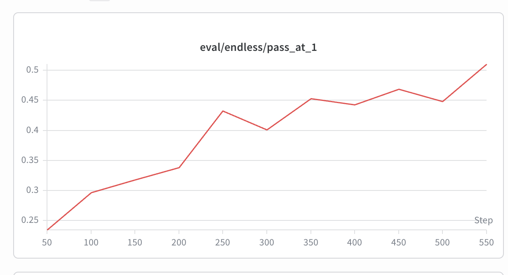

# Reproducing OSS Agentic-RL Recipes — Status Summary

A running log of our attempts to reproduce open-source **agentic reinforcement
learning** recipes (LLM agents trained with RL on real, verifiable, multi-turn
environments: terminals, SWE-bench, etc.). For each recipe we record the model,
RL framework, hardware, rollout strategy, data, and what actually happened.

> Scope note: "agentic" here means the policy interacts with a real environment
> over many turns (run a shell command / edit code → observe stdout/test result →
> act again), and the reward comes from an objective verifier (pytest /
> FAIL_TO_PASS), not a learned reward model.

---

## TL;DR comparison

| # | Recipe | Paper / Code | Model | Framework | GPUs | Result | Status |
|---|--------|--------------|-------|-----------|------|--------|--------|
| 1 | **Endless Terminals** | [arxiv 2601.16443](https://arxiv.org/pdf/2601.16443) · [kanishkg/endless-terminals](https://github.com/kanishkg/endless-terminals) | Qwen2.5-7B-Instruct | SkyRL v0.4 + Ray + vLLM, **PPO** | 4×H100 | held-out pass@1 **~15.5% → ~51%** ([W&B](https://meta.wandb.io/yichuan/simrl-sky-endless/runs/78ddk7ri)) | ✅ **Success** (clear eval gain) |
| 2 | **Echo** | [microsoft/echo-rl](https://github.com/microsoft/echo-rl) (follow-up to #1) | Qwen3-8B | SkyRL + echo-rl patch, **GRPO** | 8×H100 | GRPO baseline pass@1 **0.254 → 0.308**; ECHO led at the one comparable point then crashed | ⚠️ **Partial** (baseline works; ECHO infra-crash; data loss) |
| 3 | **slime coding_agent_rl** | [THUDM/slime example](https://github.com/THUDM/slime/tree/main/examples/coding_agent_rl) · [our notes](https://yichuan-w.github.io/blog/slime-coding-agent-rl-status/) | Qwen3.6-35B-A3B (MoE) | slime (Megatron + SGLang + Ray) | 64×H100 (official) | never trained | ❌ **Not runnable** (no E2B sandbox, no training data) |
| 4 | **Polar Agent** | Polar + Codex-CLI scaffold, SWE-Gym | Qwen3.5-4B | slime + Megatron + SGLang + **Polar**, **GRPO** | 8×H100 | ran but reward kept oscillating; abandoned | ❌ **Abandoned** (too many infra bugs) |
| 5 | **tau-bench (retail)** | [yichuan-w/slime](https://github.com/yichuan-w/slime) · `examples/tau-bench` | Qwen3-4B-Instruct-2507 | slime (Megatron + SGLang + Ray), **GRPO** | 4×H100 (2 train + 2 serve) | eval/retail-dev **0.739 → 0.791**, but **~20 min/step** | ⚠️ **Works & learns, too slow** (MetaGen user-sim bottleneck) |
| 6 | **Search-R1** | [yichuan-w/slime](https://github.com/yichuan-w/slime) · `examples/search-r1` | Qwen2.5-3B | slime (Megatron + SGLang + Ray), **GRPO** | 4×H100 (2 train + 2 rollout) | clean rising curve ([W&B](https://meta.wandb.io/yichuan/slime-search-r1)) | ✅ **Fast & reproducible** (found a stop-token bug → PR to slime soon) |

**One-line takeaways**
- **#1 Endless Terminals is the clearest win** — RL visibly lifts held-out pass@1.
- **#2 Echo's GRPO baseline reproduces the trend**; the ECHO variant only crashed on infra, and its single aligned data point already led the baseline.
- **#3 and #4 are blocked by infrastructure / data**, not by the RL idea itself.

---

## 1. Endless Terminals — ✅ most successful

**Paper:** https://arxiv.org/pdf/2601.16443 · **Code:** https://github.com/kanishkg/endless-terminals ·
**W&B:** https://meta.wandb.io/yichuan/simrl-sky-endless/runs/78ddk7ri

Headline result: a clear, near-monotone eval improvement — held-out pass@1 roughly
**triples** over training.

> **held-out pass@1 (`eval/endless/pass_at_1`): base ~15.5% → ~0.235 @ step 50 →
> ~0.51 @ step 550** (eval every 50 steps).



*W&B `eval/endless/pass_at_1`: steady climb 0.235 → 0.51 across steps 50–550 (the
two dips at 300 and 500 are normal RL noise; the trend is clearly up).*

### Model
- **Qwen2.5-7B-Instruct** (7.6B params).
- Three copies live on the GPUs during training: **Policy** (training, with Adam),
  **Critic** (PPO value network, also 7B, with its own optimizer), and **Ref**
  (frozen, for KL).

### RL framework
- **SkyRL v0.4** (installed from the `skyrl_train-v0.4.0` tag) + **Ray** orchestration
  + **vLLM 0.13** for inference.
- Algorithm: **vanilla PPO** straight from the paper — GAE γ=1.0 / λ=1.0,
  asymmetric clip 0.2 / 0.28, **no KL penalty**.

### Hardware
- **4× H100 (98 GB).** All 4 cards simultaneously hold the training shards
  (FSDP2 full shard) **and** a vLLM inference engine (1 per card, TP=1),
  time-shared via sleep/wake.

### Trainer / rollout strategy
SkyRL **colocate + sleep/wake**:
- **Generate:** vLLM wakes, takes the GPUs, runs the rollout (**256 trajectories =
  16 prompts × 16 samples**, each up to **16 turns** of terminal interaction); the
  training side yields its memory.
- **Train:** vLLM sleeps and frees memory; FSDP does forward / critic_train /
  policy_train.
- **Weight sync:** after training, push new weights to vLLM over **NCCL** (never
  hits disk).
- **~8–9 min / step** (rollout ≈ 45%, because each turn really executes shell
  commands + `pytest` inside an Apptainer container).

### Data
- Source: HuggingFace `obiwan96/endless-terminals` — **2,492 tasks** pre-generated
  by the authors and already filtered with o3 pass@16. We downloaded and used them
  directly (did **not** re-run the generation pipeline).
- Funnel:
  ```
  2492  (HF original)
    └─ 5.5% (138) build failures  ← IPv6 proxy wall, missing sqlite3/jq, etc.
  2354  (containers built)
    ├─ 2162  train
    └─  192  val / held-out dev   (never touched in training, zero overlap)
  ```
- Each task = a natural-language ops instruction (parse an INI and emit a report,
  configure iptables, create an SSH key, …) + an Apptainer container (pre-seeded
  initial state) + a terminal `pytest` that byte-checks the final state for a
  **binary reward**.
- vs paper: paper used 3,255 tasks; we have 2,162 (fewer — no self-generation +
  5.5% build loss). Slightly fewer steps / possibly a slightly lower ceiling, but
  it does **not** change the "RL works" conclusion.

### Caveat
- The eval is **in-distribution with training** (held-out split of the same
  generator). We did **not** run the final, harder evaluation on the real
  Terminal-Bench.

---

## 2. Echo — ⚠️ GRPO baseline reproduces; ECHO variant infra-crashed

**Code:** https://github.com/microsoft/echo-rl (a follow-up to Endless Terminals)

Outcome: we got it running. The **GRPO baseline trend reproduced cleanly**; the
**ECHO** variant (adds a world-model loss) only died on an infrastructure error,
and at the single comparable step it was already ahead. Full reproduction is
**blocked by data loss**, but GRPO is still climbing.

### Model
- **Qwen3-8B** (dense 8B), with a custom chat template
  `qwen3_xml_tool_calling.jinja` (XML-style tool calling).

### RL framework
- **SkyRL (NovaSky) + echo-rl patch** (adds the world-model loss).
- Training backend **FSDP2** (8-card shard); inference **vLLM**; weight sync
  **NCCL** (train → vLLM).
- Algorithm: **GRPO** (group-normalized advantage, normalized by std, **no critic**).
- Environment: **Harbor + podman** containers running terminal tasks. *(Harbor is
  the env format used in the original code; podman is basically Docker.)*

### Hardware
- **8× H100 (single node)**, `colocate_all: true` — policy / ref / vLLM all packed
  onto the same 8 cards (vLLM woken for generation, switched back for training).
  Same order of magnitude as the paper's 8×B200/A100.

### Trainer / rollout strategy
A GRPO **generate → score → update** loop, fully **colocated** (FSDP2 trainer and
vLLM share the cards).
- **Rollout side:** vLLM with `tensor_parallel_size=1` → 8 data-parallel replicas
  (1 engine/card), mem util 0.8. Each step takes **16 prompts × 16 samples = 256
  rollouts**. Each rollout is a full multi-turn terminal episode (model emits a
  command → executed in Harbor/podman → stdout/error fed back as the next
  observation), **max 16 turns**, **16k** context, **≤2048 tokens/turn**, temp 0.8.
  A validation script in the container yields the **0/1 reward**.
- **Trainer side:** the 256 trajectories get GRPO group-normalized advantages
  (16 per task, normalized & divided by std, no critic, no KL), then FSDP2 backward
  across 8 cards — mini-batch 16, micro-batch 1/card, **lr 1e-6 constant (no
  warmup)**, clip ε=0.2. **ECHO vs baseline differ only in the loss:** baseline
  computes `L_GRPO` on action tokens only; ECHO adds a cross-entropy term on the
  *environment-observation* tokens (λ=0.05), reusing the same forward pass — **no
  extra rollout**. New weights sync back to vLLM over NCCL.
- Bottleneck is **rollout, not GPU compute** (running commands in containers is
  CPU/IO-bound) → **~17 min / step**, generation dominates.

### Results — run2 (small A/B, completed)
A small controlled run: 238 tasks, n=8, ~56 steps; val 60 tasks ×4; goal was to
get the pipeline working and see the direction.
- **GRPO baseline succeeded:** pass@1 from base **~0.254**, a small dip to 0.242,
  then **0.292 @ step 28** and **0.308 @ step 42** — net **+~6 pts**, smooth curve.
  Confirms reward signal, container execution, and de-noised eval are all correct;
  GRPO learns at this scale.
- **ECHO did not finish:** it crashed at **step 23** from a vLLM colocate-wake
  `aiohttp 500` — an **infra** problem unrelated to the world-model loss (baseline
  just never hit it). Before crashing it produced base (0.258) and step 14 (0.279).
  At step 14 — the only point alignable with baseline — **ECHO pass@1 0.279 vs
  baseline 0.242**, **pass@4 0.533 vs 0.450**: ECHO leads on both, consistent with
  the paper's "ECHO pulls ahead earlier."

### Data
- **1,536 tasks** (`run3_train.parquet`) + **val 60** (`run2_val`, ×8 eval).
- vs paper's **8,770** (of which **6,170 are unpublished**). We converted 1,616
  from Endless Terminals and pre-built 1,536 images.
- Conclusion: **substantial data is missing → cannot fully reproduce**, but GRPO is
  still growing on what we have.

---

## 3. slime `coding_agent_rl` — ❌ not runnable as-is

**Code:** https://github.com/THUDM/slime/tree/main/examples/coding_agent_rl ·
**Our notes:** https://yichuan-w.github.io/blog/slime-coding-agent-rl-status/

We did **not** train this — only read the README and had Claude Code walk through it.

> In one sentence: it borrows the **claude-code CLI** as the agent "body", but swaps
> the brain for the model you're training, and uses "**do the tests pass?**" as the
> reward.

**Why it doesn't run for us:**
1. It needs the **E2B** sandbox service — we have no sandbox service.
2. **No training data is prepared** — only the data *format* is provided.

### Model
- **Qwen3.6-35B-A3B** — MoE: ~35B total, ~3B active (256 experts, top-k 8, 40
  layers, shared expert). hidden 2048 / ffn 512 / moe-ffn 512, vocab 248320, rope
  base 1e7. Qwen3.5/3.6 features: `--use-gated-attention`,
  `--attention-output-gate`, `--moe-shared-expert-gate`, `--qk-layernorm`. Wired
  into Megatron via the `slime_plugins.models.qwen3_5` spec.

### RL framework
- **slime** (THUDM / Z.ai — the RL framework behind GLM-4.5/4.6/4.7/5): training =
  **Megatron-LM**, rollout = **SGLang**, orchestration = **Ray**, all on one
  train/rollout/data-buffer dataflow. The example injects a custom rollout via
  `--custom-generate-function-path` (the claude-code + E2B sandbox loop).

### Hardware
- Official **64× H100 (8 nodes × 8)**, `--colocate`.
- ⚠️ 64 is **not** a hard requirement — it reflects Z.ai's cluster scale +
  throughput + 96k long context (CP=8). The model itself fits in 8 cards.

---

## 4. Polar Agent — ❌ ran but abandoned (too many bugs)

Trained with a **scaffold (Codex CLI)** in the loop. (The slime example above also
trains with claude-code, so the two aren't very different in spirit.)

TL;DR: we got it running, but **reward keeps oscillating** — likely several causes
compounding — and there were too many infra bugs, so we **gave up**.

> Config quirk: `harness: "codex"`, `model_name: "gpt-5.4"`, but requests are
> proxied by the Polar gateway to a **local SGLang engine running Qwen3.5-4B**.

### Model
- **Qwen3.5-4B** (4B VLM). Hybrid attention: per 4 layers, 1 full-attention layer +
  3 **GatedDeltaNet** (linear-attention) layers. The paper used **Qwen3-32B** (8×
  bigger); we use 4B because 8×H100 can't fit 32B training. HF weights converted to
  Megatron `torch_dist`.

### RL framework — three layers
```
Slime (THUDM)            — RL framework: GRPO + manages SGLang
  ├── Megatron-LM        — distributed training backend (TP=2)
  ├── SGLang 0.5.10      — inference engine (6 engines, 1 GPU each)
  └── Polar              — rollout orchestration (agents in containers)
       ├── Gateway        — schedules Docker containers, proxies LLM requests
       └── Rollout Server — task dispatch + result collection
```
- **GRPO**: leave-one-out advantage; KL `low_var_kl` coef=0.001; PPO clip
  eps=0.2 / eps_high=0.28; **LR=1e-7** (paper used 1e-6 — lowered because of NaN
  gradients); grad clip 0.5; bf16.

### Hardware
**8× H100 95GB**

| GPU | Use | Memory |
|-----|-----|--------|
| 0–1 | Megatron GRPO training (TP=2) | ~70 GB |
| 2–7 | SGLang inference (6 × TP=1) | ~81 GB/card |

Weight sync: NCCL GPU-to-GPU, broadcast from GPU 0–1 → 2–7 every step.

### Trainer / rollout strategy — Async GRPO + Rollout-as-a-Service
1. **Rollout:** Slime sends **4 prompts** (`rollout-batch-size=4`) to Polar; each
   prompt → **8 rollouts** (`n-samples-per-prompt=8`) → **32 agent sessions**. Each
   session: Polar starts a Docker container → runs the **Codex CLI agent** → the
   agent reaches SGLang **through the Polar gateway** → multi-turn bug fixing →
   **SWE-bench harness** evaluates the patch → reward 0/1. `dynamic-history`: every
   turn of every agent interaction is a training sample.
2. **Train:** after collecting 32 rollouts, Slime does the GRPO update — Megatron
   forward/backward on GPU 0–1 → NCCL broadcast new weights to the 6 SGLang
   engines. `max-tokens-per-gpu=20000` bounds batch memory.
3. **Async:** rollout and train run asynchronously;
   `polar_allow_weight_update_overlap=true`;
   `polar_min_complete_accept_fraction=0.25` (accept once 25% of sessions finish).

### Data
- **293 SWE-Gym tasks** (`NovaSky-AI/SkyRL-v0-293-data`).
- Real GitHub bug reports (moto, pandas, dask, mypy, conan, iterative/dvc, bokeh,
  pydicom, …). Each task: `problem_statement`, target repo commit, `FAIL_TO_PASS`
  + `PASS_TO_PASS` tests, and a Docker image (1–3 GB each, ~500 GB total) carrying
  the repo code + conda env + all deps.
- Paper used **4,500 R2E-Gym tasks** (15× more). *(This data is also our lab's
  work.)*

### Known problems (why we stopped)
**Fatal**
1. **Agent timeout doesn't fire** — Polar can't detect a stuck agent (zombie git,
   502 reconnect loop), so it can't kill it.
2. **Weight update can hang** — `pause_generation` waits for the agent to release
   the engine (added a 120s timeout, not yet verified).

**Medium**
3. **GPU OOM** — after ~60 steps PyTorch memory creeps to 95 GB and crashes;
   dropping to 20000 tokens/gpu may help.
4. **GatedDeltaNet NaN gradients** — Qwen3.5 backward is unstable on H100; worked
   around by skipping NaN steps.

---

## 5. tau-bench (retail) — ⚠️ works & learns, but too slow

**Code:** https://github.com/yichuan-w/slime · `examples/tau-bench`

Outcome: the pipeline is correct and reward goes up, but it is **impractically
slow — ~20 min/step** — mainly because the user-simulator runs on the **MetaGen
API**, which is slow, plus a few compounding factors. The bottleneck is the
**user-mimic (customer simulation)**, not GPU compute.

### Model
- **Qwen3-4B-Instruct-2507** (the agent / policy being trained).

### RL framework
- **slime** (Megatron-LM training + SGLang rollout + Ray), algorithm **GRPO**.
- Runs in a **self-built venv** (torch 2.11+cu129 / sglang 0.5.12.post1 / TE 2.10 /
  apex / flash-attn2 / Megatron), reproducible via `examples/tau-bench/build_venv_uv.sh`.

### Hardware
- **4× H100, NON-colocate: 2 GPUs train (Megatron TP=2) + 2 GPUs serve (SGLang).**

### Trainer / rollout strategy
- Each step rolls out **32 prompts × 8 samples = 256 trajectories**. Each trajectory
  is a multi-turn retail customer-service dialog: the trained agent talks to a
  **user-simulator** (an LLM playing the customer) and calls retail tools, until
  the tau-bench verifier scores the episode **0/1**.
- **User-sim = MetaGen `gemini-3-flash` via an OpenAI-compatible endpoint.**
- **Bottleneck = user-sim round-trips.** During rollout the serving GPUs sit at
  **~0% util** — the trajectories spend their time waiting on the MetaGen API, not
  generating. Steps land at **~20 min** (rollout dominates; train is only ~4 min).
- Speedups attempted (helped eval, not the training step):
  - **Disable user-sim "thinking"** (`thinking_budget=0`): gemini-flash is a
    reasoning model burning ~180 reasoning tokens/turn; turning it off cut per-turn
    latency ~40% and **eval 5.5 min → 2.1 min (~2.5×) with identical reward**.
  - **Concurrency 256** (= the 256 trajectories). But measured *effective* agent
    concurrency stayed low (median 2, bursts to ~190) because the 256 trajectories
    phase-lock (all wait on the user-sim, then all generate) — so raising
    concurrency didn't shorten the training step.

### Results
- **eval/retail-dev: 0.739 → 0.791** over the first few steps (direction is right).
- Training `raw_reward` ~0.66–0.70, noisy with a slight upward drift.

### Status / caveat
- **Paused.** It learns, but at ~20 min/step on 4 GPUs it's too slow to push to a
  full curve, and the limiter is an external slow API (MetaGen user-sim) rather
  than anything we can fix on-box. With only 2 serving engines (vs the usual 4) the
  per-step cost is also structurally higher.

---

## 6. Search-R1 — ✅ fast, clean curve, a good reproduction target

**Code:** https://github.com/yichuan-w/slime · `examples/search-r1` ·
**W&B:** https://meta.wandb.io/yichuan/slime-search-r1

Outcome: **the best "easy win" of the slime-based attempts** — fast steps, a clean
rising curve, and a relatively simple environment. Along the way we found a **key
multi-turn/tool-calling bug** (below) that we'll **submit to slime soon**.

### Key bug found (PR to slime soon) — stop at the tool/answer boundary
In multi-turn tool-calling, the inference engine **did not stop at the
`</search>` / `</answer>` boundary**. Without an explicit stop, SGLang keeps
emitting tokens *after* the closing tag, which:
1. get appended to the trajectory and **trained on** (`loss_mask=1`), and
2. **break `is_valid_sequence`** (token/logp arrays no longer align with the
   intended turn boundary).

**Fix:** add `</search>` and `</answer>` as **stop strings** in the sampling params
(slime already sets `no_stop_trim=True`, so the closing tag is *kept* in the
output). This stops generation exactly at the tool/answer boundary and keeps
token/logp alignment natively — no post-hoc truncation needed.

### Model
- **Qwen2.5-3B** (`--hf-checkpoint Qwen2.5-3B`).

### RL framework
- **slime** (Megatron-LM + SGLang + Ray), **GRPO**: `--use-kl-loss`, PPO clip
  0.2 / 0.28, **lr 1e-6**.
- Custom rollout `generate_with_search.generate` + reward `generate_with_search.reward_func`.

### Hardware
- **4× H100, NON-colocate: 2 train (actor TP=2) + 2 rollout (SGLang TP=2, 1 engine).**
- Infra note: a wrapper (`run_search_r1_autorestart.sh`) resumes from the latest
  checkpoint when `oomd` reaps the run under memory pressure (the run is healthy,
  it just gets reaped); the local retriever is a separate process and untouched.

### Trainer / rollout strategy
- **Multi-turn + tool-calling**, where the "tool" is a **local dense retriever**
  (`local_dense_retriever` / `local_search_server.py`) — no heavy container or
  external sandbox. Each rollout: the model emits `<search>query</search>` → the
  retriever returns documents as the next observation → … → `<answer>…</answer>`.
- **32 prompts × 8 samples = 256 trajectories**, max **512 tokens/turn**,
  global batch 256. Reward = **QA exact-match** (`qa_em_format`).
- **Fast**: simple local retriever + short responses → steps are quick (no
  container exec, no slow external API), and the curve is clean.

### Data
- **Search-R1 NQ + HotpotQA** (`nq_hotpotqa_train/train.parquet`), eval on
  `nq_test` (first 500 of the test split).

### Why it's a good reproduction target
- Environment is **relatively simple** (local retriever, no sandbox/containers),
  yet it's genuinely **multi-turn with tool-calls** — so it exercises the same
  agentic-RL machinery as the harder recipes but **fast and reproducible**, with a
  **clean rising W&B curve**.

---

## Cross-cutting lessons

- **The RL idea reproduces; the *infrastructure* is the hard part.** Where data and
  sandboxing were solid (#1, #2-baseline) we saw clear learning. Where they
  weren't (#3 data/sandbox, #4 orchestration bugs) the run stalled — not the
  algorithm.
- **Data availability is the gating factor.** #2 and #4 are both partially
  unreproducible purely because a large fraction of the training tasks are
  unpublished.
- **Rollout, not GPU compute, is the bottleneck** for every container/terminal
  recipe — episodes are CPU/IO-bound on real command execution, so steps land at
  ~8–17 min regardless of card count.
- **Colocate (sleep/wake) is the common pattern** for fitting trainer + inference
  on a single node; its main failure mode is the vLLM/SGLang wake path (see #2's
  aiohttp 500 and #4's pause_generation hang).
- **Simple, *local* environments are the most reproducible.** Search-R1 (#6) wins
  precisely because its "tool" is a local retriever — no container, no sandbox, no
  external API — so steps are fast and the curve is clean. The harder recipes are
  gated by exactly those external pieces.
- **An external API in the rollout loop is a bottleneck you can't fix on-box.**
  tau-bench (#5) is limited by the MetaGen user-sim latency; no amount of local GPU
  or concurrency tuning removes the network round-trips that dominate each step.
- **Watch for silent multi-turn/tool-boundary bugs.** Search-R1's stop-token issue
  (#6) trained on out-of-boundary tokens and corrupted token/logp alignment without
  obviously crashing — the kind of bug that quietly caps a curve. Verify the engine
  stops exactly at your tool/answer tags.
