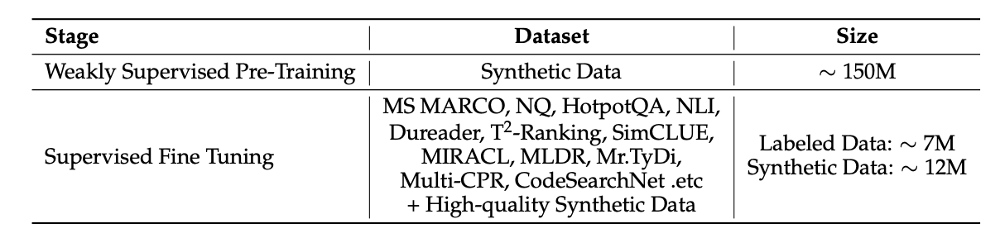

# Qwen3 Embedding: Advancing Text Embedding and Reranking Through Foundation Models

## Authors & Affiliations

**Tongyi Lab, Alibaba Group:**

## Key Takeaways

- **Novel Multi-Stage Training Pipeline**: Qwen3 Embedding introduces an innovative training approach that combines large-scale unsupervised pre-training with supervised fine-tuning, leveraging Qwen3 LLMs both as foundational models and as generators of diverse, high-quality training data
- **Synthetic Data Focus**: The majority of pre-trained data and supervised fine-tuning utilize synthetic data
- **Scalable Model Family**: The Qwen3 Embedding series offers multiple model sizes (0.6B, 4B, 8B) optimized for different efficiency and effectiveness trade-offs
- **State-of-the-Art Performance**: Consistently achieves superior results on multilingual and retrieval benchmarks such as MTEB
- **Competitive Small Models**: Even the 0.6B model can match Gemini embedding performance and outperforms all other open-source and commercial APIs

## Training Methodology

### Three-Stage Training Pipeline

1. **Large-Scale Synthetic Data-Driven Weak Supervision Training**
   - Training starts from Qwen3 base model
   - Modified attention mechanism: casual mask changed to full attention

2. **High-Quality Synthetic Data Utilization in Supervised Fine-Tuning**
   - Focus on curated, high-quality synthetic data
   - Critical stage for model performance

3. **Model Merging**

### Data Curation Details

*Note: Specific data curation methodology not fully detailed in the original notes*

and the only data recipe is like this it is really a good take that most data used for training is synthetic data

## Unresolved Questions

The paper appears to have some important implementation details that require clarification:

- **High-Quality Data Filtering**: How exactly are high-quality synthetic data samples identified and selected? 
  - Possibly involves filtering query-document pairs based on similarity scores (not too high or too low) using other embedding models
- **Hard Negative Sampling**: The methodology for generating hard negative samples is unclear
- **Specific Training Objectives**: Detailed loss functions and optimization targets not specified

## Results & Performance

### Key Performance Metrics

- **Benchmark Leadership**: State-of-the-art results on MTEB and other multilingual retrieval benchmarks
- **Model Efficiency**: 0.6B parameter model achieves competitive performance with much larger commercial systems
- **API Comparison**: Outperforms existing open-source and commercial embedding APIs

### Ablation Studies

**Critical Finding**: The second training stage (supervised fine-tuning with high-quality data) is crucial for achieving optimal performance. The supervised signal and data quality at this stage significantly impact final model capabilities.

## Technical Architecture

- **Base Model**: Built upon Qwen3 LLM architecture
- **Attention Modification**: Transition from causal masking to full attention mechanism
- **Multi-Scale Approach**: Three model variants (0.6B, 4B, 8B parameters) for different deployment scenarios

## Implications

This work demonstrates that synthetic data generation combined with careful multi-stage training can produce highly competitive embedding models. The success of the smallest (0.6B) model variant suggests that efficient embedding systems can be built without requiring massive parameter counts, making advanced text embedding more accessible for resource-constrained applications.